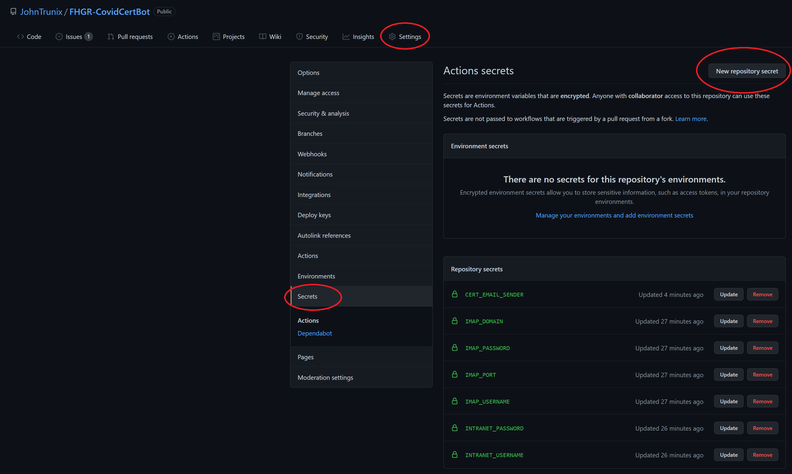

# FHGR-CovidCertBot
## Functions
---
1. The CovidCertBot is designed for Github Actions. First it will scan your defined imap Email Inbox and look for a new Covid-Certificate.
2. It will download the Covid-Certificate and extract the test date
3. Afterwards it makes a post request to get the cookie for upload the files
4. It uploads the required data and the Covid-Certificate pdf

## Setup Github Actions
1. Fork my Repository
2. Create new secrets like in the example.env file
   
3. You can trigger the workflow manually by going to Actions -> Workflow -> Run workflow -> Run workflow
4. You also can adjust the cronjob scheddule here some helpful link [Crontab Guru](https://crontab.guru/)

<br/>

---
## Setup for local development


### Dependencies
- Any Python 3.xx Version
- Take a look at the requirements.txt

### Variables
Create a new .env file and copy the variables from example.env
```.env
# Email setup
IMAP_DOMAIN = imap.exigo.ch
IMAP_PORT = 993
IMAP_USERNAME = exampleuser
IMAP_PASSWORD= password

# Intranet setup
INTRANET_USERNAME = "exampleuser"
INTRANET_PASSWORD = "password"

# Email from the sender of the Covid-Certificate
CERT_EMAIL_SENDER = noreply@2weeks.ch
```
### Run
```.cmd
python3 main.py
```
## Contributions and Issues
Feel free to make any contributions or open issues if you have some troubles.

## Credits
> Co-Authored by [Thomas Glauser](https://github.com/thomasglauser).